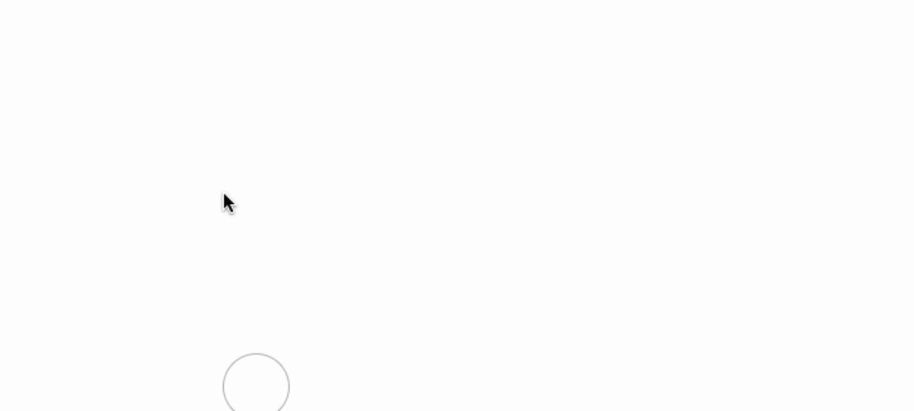
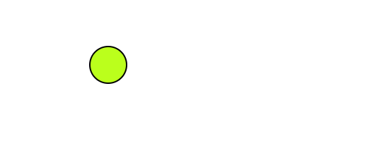

# Cursor Magic

[](https://github.com/takutakuaoao/cursor-magic/releases/tag/v0.3.0)
[](LICENSE)


Cursor Magic is cursor effects library, a simple and easy-to-use.

This library is available in vanillaJS and React.

**Demo**

1. Cursor Pointer

    

## Installation

- Including dist/cursor-magic.js from latest tag to your project. [Here tags](https://github.com/takutakuaoao/cursor-magic/tags).
- Using npm: `npm install cursor-magic`

## Usage

### Simple way

```html
<script type="module">
    import { createCursorMagic } from "path/to/cursor-magic/dist/cursor-magic.js";

    createCursorMagic();
</script>
```

### Customize pointer

```html
<script type="module">
    import { createCursorMagic } from "./node_modules/cursor-magic/dist/cursor-magic.js";

    createCursorMagic({
      cursorSize: 50, // pointer size
      // ↓ customize pointer style
      cursorStyle: {
        backgroundColor: "#bbff00e3", // background color
        border: "solid 2px #000000", // adding border style
      },
    });
</script>
```

**Customized pointer screenshot**



## For React

Firstly, you need to install using npm. `npm i cursor-magic`

Secondary, you need to import `cursor-magic/react` package, not `cursor-magic`.

**Example**

```jsx
'use client' // ← Add if necessary.

import CursorMagic from 'cursor-magic/react'

const CursorMagicClient = () => {
    return <CursorMagic />
}

export default CursorMagicClient
```

If you try to customize styling, the following can be set in the component props.

```jsx
'use client'

import CursorMagic from 'cursor-magic/react'

const CursorMagicClient = () => {
    return <CursorMagic
      cursorSize={50}, // pointer size
      // ↓ customize pointer style
      cursorStyle={{
        backgroundColor: "#bbff00e3", // background color
        border: "solid 2px #000000", // adding border style
      }},
    />
}

export default CursorMagicClient
```

## Issues

We have obviously not tested this on every website. If you run into an issue, or find a way the automatic detection could be better, please [create an Issue](https://github.com/takutakuaoao/cursor-magic/issues/new). If you can include a test case, that's even better.
